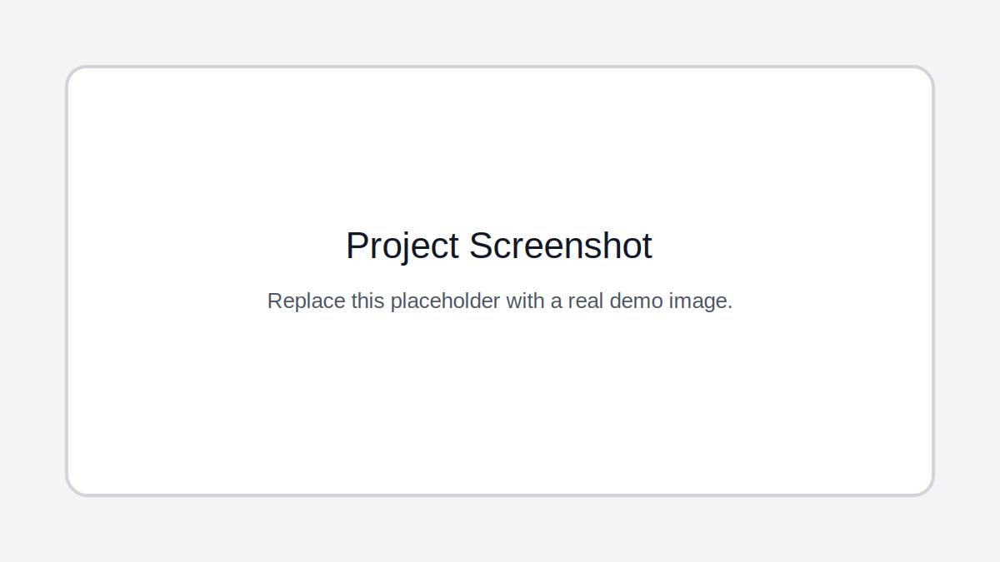

# Machine Learning Practice Notebooks

## Description

A collection of applied machine learning notebooks covering decision trees, image augmentation, diabetes prediction, and neural network tuning practice.

## Key Features

- Decision tree classification notebook
- Image augmentation workflow
- Diabetes dataset neural network experiment
- CSV datasets included for practice
- Notebook-based learning collection

## Tech Stack

- Python
- Jupyter Notebook
- Pandas
- scikit-learn
- TensorFlow
- Keras
- Matplotlib

## Installation

pip install pandas numpy scikit-learn tensorflow matplotlib seaborn pillow

## Usage

Open the notebooks in Jupyter or Colab and run each workflow with the included CSV datasets.

## Screenshots

Add project screenshots to the `screenshots/` folder. Replace `demo.svg` with the actual image filename when screenshots are available.

## License

No license file is currently included. Add a license before reusing, distributing, or publishing this project for public collaboration.

